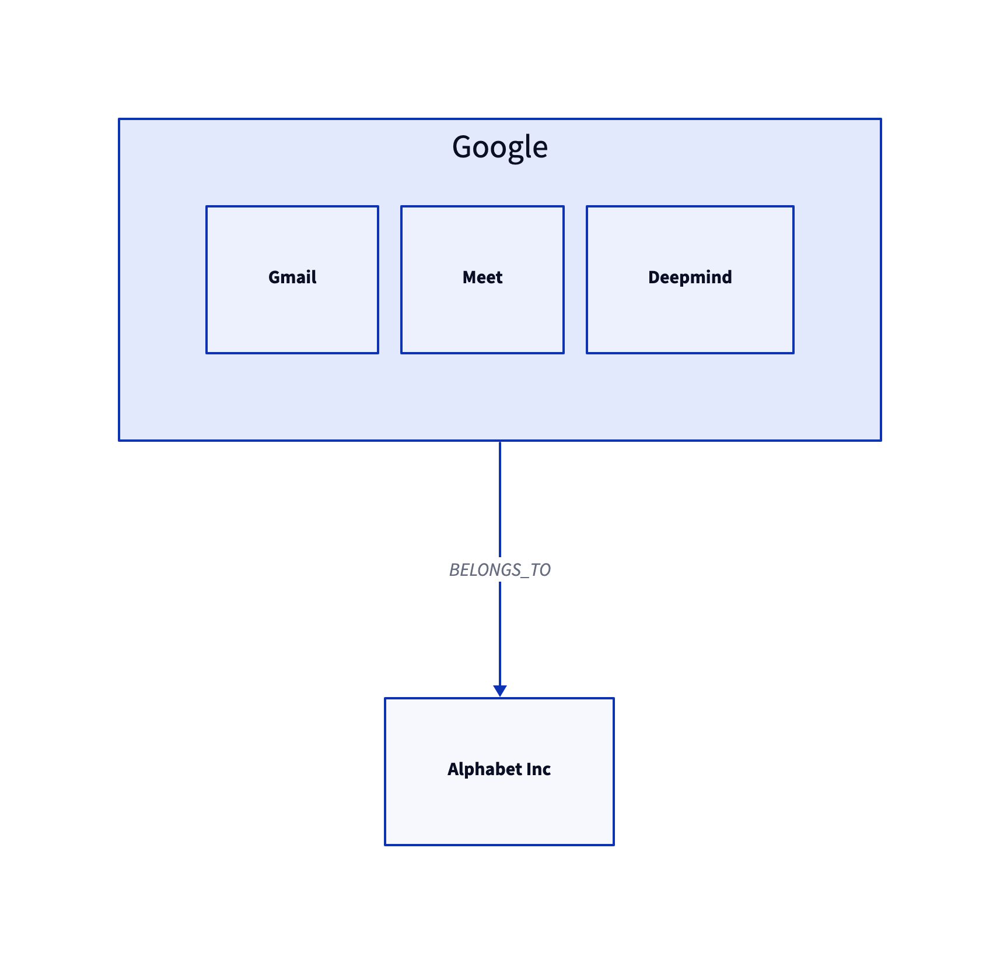

# d2lang-js


An unofficial interface for building [D2](https://github.com/terrastruct/d2) diagram files in javascript.

## Installation

```
npm install d2lang-js
```
## Usage
```javascript
import d2 from "d2lang-js";

const umbrella = new d2.D2Shape(
    "alphabet",
    "Alphabet Inc",
    d2.Shape.rectangle
)
const company = new d2.D2Shape(
    "google",
    "Google",
    d2.Shape.rectangle
)
company.addShape(new d2.D2Shape("gmail", "Gmail", d2.Shape.rectangle));
company.addShape(new d2.D2Shape("meet", "Meet", d2.Shape.rectangle));
company.addShape(new d2.D2Shape("deepmind", "DeepMind", d2.Shape.rectangle));

const connection = new d2.D2Connection(company.name, umbrella.name, "BELONGS_TO", d2.Direction.TO);

const diagram = new d2.D2Diagram([umbrella, company],[connection]);
console.log(diagram.toString());
```

### D2 Output 
```
alphabet: Alphabet Inc {
  shape: rectangle
}
google: Google {
  gmail: Gmail {
    shape: rectangle
  }
  meet: Meet {
    shape: rectangle
  }
  deepmind: Deepmind {
    shape: rectangle
  }
  shape: rectangle
}
alphabet -> google
```

#### Online compiler
[D2 Playground](https://play.d2lang.com/)

#### Result of output above


## Supported

- [x] Shapes (nodes)
- [x] Connections (links)
- [x] Styles
- [x] Containers (nodes/links in nodes)
- [x] Shapes in shapes
- [x] Arrow directions
- [ ] Markdown / block strings / code in shapes
- [ ] Icons in shapes
- [ ] SQL table shapes
- [ ] Class shapes
- [ ] Comments

## Inspiration
[py-d2](https://github.com/MrBlenny/py-d2)
